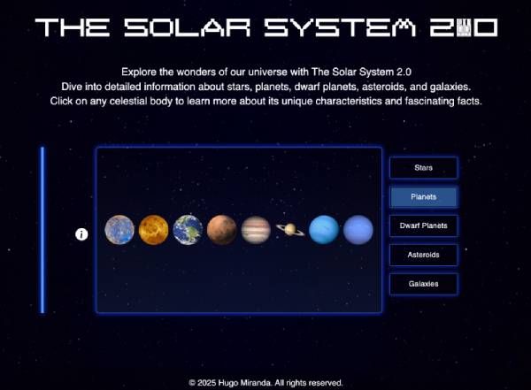
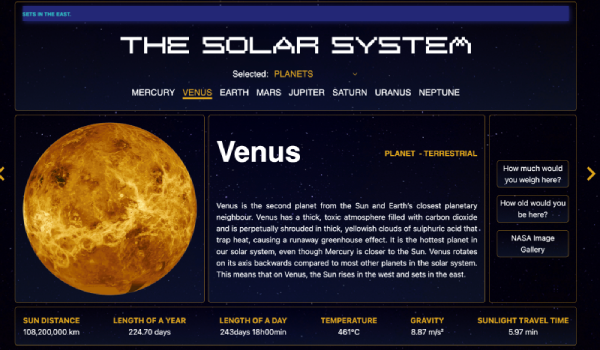

# The Solar System: An Interactive Project

An interactive project that displays information about celestial bodies in the solar system, including planets, dwarf planets, asteroids, and galaxies. Fully developed from scratch, with a frontend in **React + TypeScript + Tailwind** and a backend in **Node.js + Express + TypeScript**.
I rebuilt this project, which I originally started in 2022, to enhance my skills in React, TypeScript, and full-stack development. I focused on creating a custom API, improving the design, and adding interactive animations to make the project more complete.

---
## ScreenShots

---

## Features

* **List of celestial bodies**: Browse a comprehensive list of planets, dwarf planets, asteroids, and galaxies.

---

## Technologies

* **Frontend**: React, TypeScript, Tailwind CSS
* **Backend**: Node.js, Express, TypeScript
* **API**: Custom-built API providing data about celestial bodies.

---

## How to Run the Project

### Backend

1.  **Clone the repository**: `git clone [Solar System API](https://github.com/hugolomba/solar-system-api)`
2.  **Navigate to the backend folder**: `cd backend`
3.  **Install dependencies**: `npm install`
4.  **Start the server**: `npm run dev`

### Frontend

1.  **Navigate to the frontend folder**: `cd frontend`
2.  **Install dependencies**: `npm install`
3.  **Start the project**: `npm start`

---

## Links

* **Live Project**: [Live](the-solar-system.hugo-miranda.dev)
